# PBL4 - Fine-tuning BASNet cho phân đoạn đối tượng nổi bật

## 1. Tóm tắt

Repository này dùng để huấn luyện, fine-tune, đánh giá và chạy dự đoán với mô hình **BASNet** cho bài toán phát hiện/phân đoạn đối tượng nổi bật (*Salient Object Detection*). Dự án kế thừa ý tưởng từ BASNet của Qin và cộng sự, sau đó điều chỉnh pipeline thực nghiệm để phù hợp với bài PBL4 và điều kiện GPU hạn chế.

Các đóng góp chính của phiên bản PBL4:

- Tinh chỉnh kiến trúc BASNet theo hướng nhẹ hơn.
- Bổ sung train/validation split, checkpoint resume và lưu model tốt nhất theo nhiều metric.
- Dùng mixed precision, gradient accumulation, AdamW, warmup + cosine scheduler.
- Bổ sung các metric đánh giá: `MAE`, `S-measure`, `E-measure`, `wFm`, `bFm`.
- Xuất biểu đồ loss, learning rate, metric và hình so sánh định tính.

Model sau fine-tune được lưu tại:

[Google Drive - BASNet fine-tuned models](https://drive.google.com/drive/folders/1fxyhRmLCfPovoN-WosHzqXmPUYlw66bS?usp=drive_link)

Do dữ liệu và checkpoint `.pth` có dung lượng lớn, GitHub chỉ lưu mã nguồn, hình kết quả và ảnh demo nhỏ. Người dùng cần tải thêm dataset/checkpoint rồi đặt đúng thư mục như hướng dẫn bên dưới.

## 2. Cơ sở lý thuyết

BASNet trong bài báo **Boundary-Aware Segmentation Network for Mobile and Web Applications** giải quyết bài toán phân đoạn nhị phân bằng kiến trúc **predict-refine**:

- **Prediction module**: encoder-decoder kiểu U-Net, có deep supervision ở nhiều tầng để sinh các side outputs.
- **Refinement module**: học phần dư giữa mask dự đoán thô và ground truth để tinh chỉnh kết quả cuối.
- **Hybrid loss**: kết hợp BCE, SSIM và IoU để học đồng thời ở mức pixel, patch và toàn ảnh.

Hàm loss tổng quát của BASNet:

```text
L = sum_k alpha_k * l_k
l_k = L_BCE + L_SSIM + L_IOU
```

Trong dự án PBL4, loss được điều chỉnh thêm thành:

```text
L_PBL4 = w_bce * L_BCE + w_ssim * L_SSIM + w_iou * L_IOU + w_edge * L_edge
```

`L_edge` được áp dụng nhẹ ở output cuối để tăng nhạy cảm với vùng biên. Các side outputs sâu vẫn được giám sát nhưng giảm trọng số để tránh over-supervision.

## 3. Kiến trúc và hình tham chiếu BASNet

Các hình dưới đây nằm trong thư mục `figures/`. Nhóm hình này dùng để trình bày nền tảng BASNet gốc và các kết quả tham chiếu trong tài liệu BASNet.

### 3.1. Kiến trúc BASNet

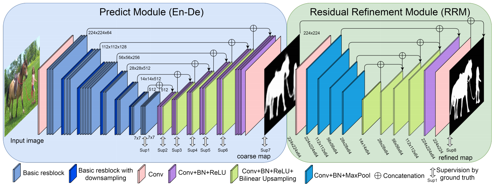

### 3.2. So sánh định lượng trong tài liệu BASNet

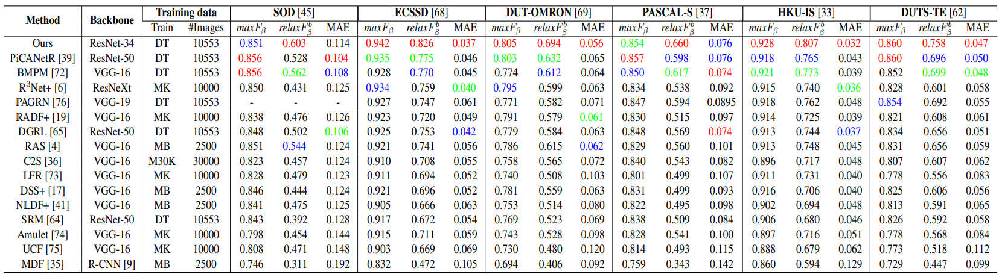

### 3.3. So sánh định tính trong tài liệu BASNet

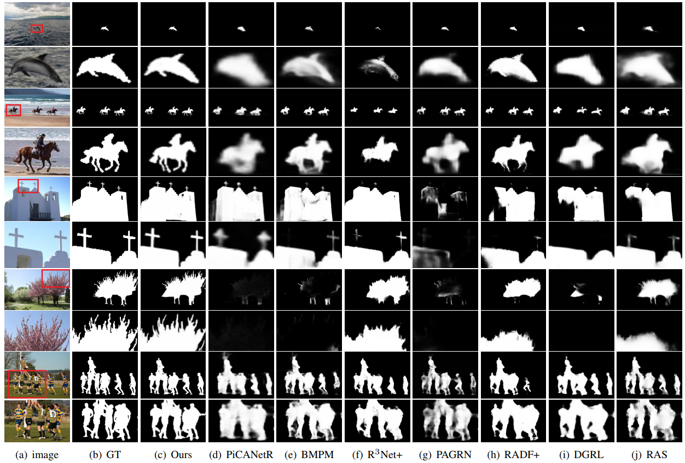

### 3.4. Salient Object Detection

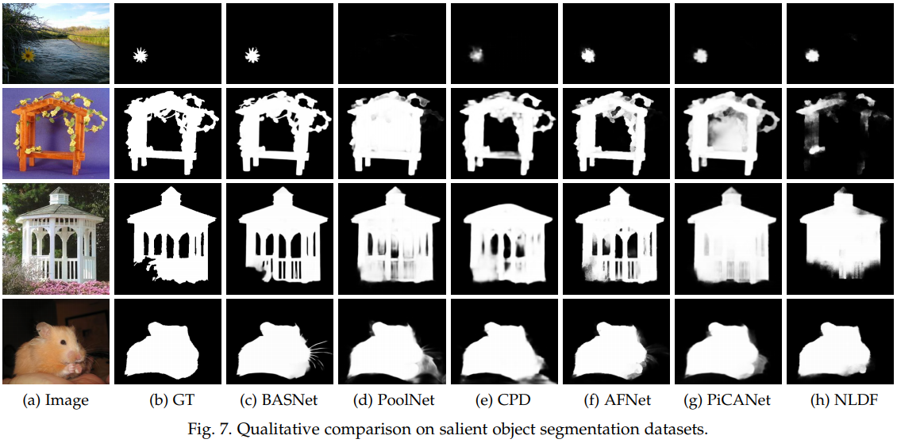

### 3.5. Salient Objects in Clutter

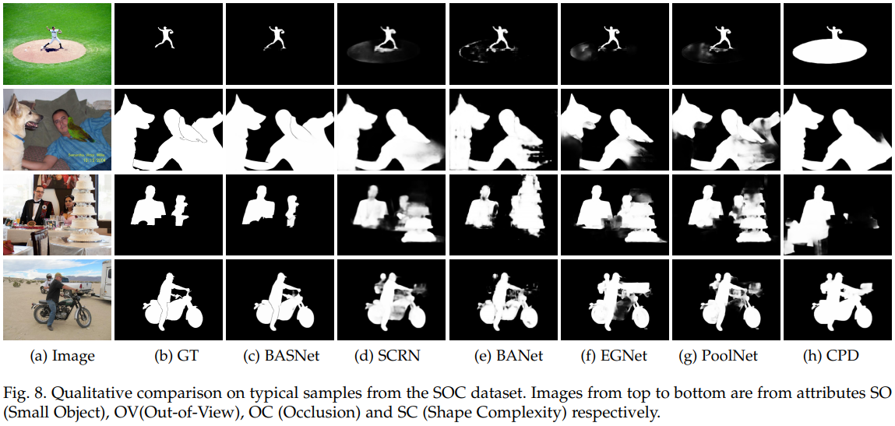

### 3.6. Camouflaged Object Detection

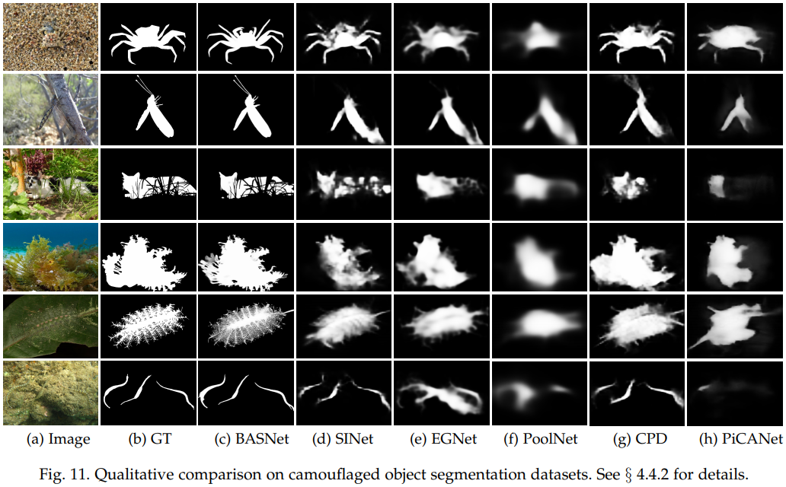

## 4. Thay đổi của dự án PBL4 so với BASNet gốc

### 4.1. Mô hình

- Dùng ResNet34 pretrained làm encoder.
- Thay BatchNorm bằng GroupNorm để ổn định khi batch size nhỏ.
- Giữ stem kiểu BASNet: convolution `3x3`, stride 1, không dùng `7x7 stride-2` và không max-pool ngay đầu mạng.
- Giảm độ nặng của context/decoder blocks so với BASNet gốc.
- Dùng `LiteRefineHead` để tinh chỉnh output cuối với chi phí thấp.
- Vẫn giữ 8 outputs để tương thích deep supervision.

### 4.2. Huấn luyện

- Bổ sung train/validation split tự động.
- Hỗ trợ resume bằng checkpoint.
- Lưu checkpoint tốt nhất theo `val loss`, `MAE`, `S-measure`, `wFm`.
- Dùng AdamW thay Adam gốc.
- Dùng warmup + cosine learning rate scheduler.
- Dùng mixed precision và gradient accumulation để phù hợp GPU ít VRAM.
- Clip gradient để tăng ổn định.

### 4.3. Dữ liệu và augmentation

Các biến đổi dữ liệu trong quá trình train:

- Resize về `SIZE_TRAIN = 224`.
- Random crop `CROP_SIZE = 192`.
- Random horizontal flip.
- Random vertical flip với xác suất thấp.
- Random rotation góc nhỏ.
- Color jitter.
- Gaussian blur nhẹ.
- Gaussian noise nhẹ.

## 5. Cấu trúc thư mục

Sau khi clone project, cấu trúc thư mục nên có dạng:

```text
.
├── demo/
├── figures/
├── model/
│   ├── BASNet.py
│   ├── resnet_model.py
│   └── __init__.py
├── pytorch_iou/
├── pytorch_ssim/
├── saved_models/
│   └── basnet_bsi/
│       ├── basnet_best_mae.pth
│       ├── basnet_best_sm.pth
│       ├── basnet_best_valloss.pth
│       ├── basnet_best_wfm.pth
│       └── checkpoint_resume.pth
├── test_data/
│   └── test_images/
├── train_data/
│   └── DUTS/
│       └── DUTS-TR/
│           ├── DUTS-TR-Image/
│           └── DUTS-TR-Mask/
├── validation_data/
│   └── DUTS-TE/
│       ├── DUTS-TE-Image/
│       └── DUTS-TE-Mask/
├── basnet_train.py
├── basnet_evaluate.py
├── basnet_test.py
├── data_loader.py
└── README.md
```

Ý nghĩa các file chính:

| File | Vai trò |
| --- | --- |
| `basnet_train.py` | Huấn luyện, validation, lưu checkpoint và xuất biểu đồ |
| `basnet_evaluate.py` | Đánh giá checkpoint trên DUTS-TE |
| `basnet_test.py` | Sinh hình so sánh định tính giữa các checkpoint tốt nhất |
| `data_loader.py` | Dataset loader và các phép augmentation |
| `model/BASNet.py` | BASNet phiên bản đã điều chỉnh cho dự án |
| `figures/` | Chứa hình kiến trúc, biểu đồ và kết quả thực nghiệm |

Nếu thiếu các thư mục dữ liệu/model, có thể tạo thủ công:

```bash
mkdir -p saved_models/basnet_bsi
mkdir -p train_data/DUTS/DUTS-TR
mkdir -p validation_data/DUTS-TE
mkdir -p test_data/test_images
```

Trên Windows PowerShell:

```powershell
mkdir saved_models\basnet_bsi
mkdir train_data\DUTS\DUTS-TR
mkdir validation_data\DUTS-TE
mkdir test_data\test_images
```

## 6. Chuẩn bị model/checkpoint

Tải model fine-tuned từ Google Drive:

[Google Drive - BASNet fine-tuned models](https://drive.google.com/drive/folders/1fxyhRmLCfPovoN-WosHzqXmPUYlw66bS?usp=drive_link)

Đặt các file `.pth` vào:

```text
saved_models/basnet_bsi/
```

Ví dụ:

```text
saved_models/
└── basnet_bsi/
    ├── basnet_best_mae.pth
    ├── basnet_best_sm.pth
    ├── basnet_best_valloss.pth
    ├── basnet_best_wfm.pth
    └── checkpoint_resume.pth
```

Lưu ý:

- Không đặt checkpoint `.pth` vào thư mục `model/`, vì `model/` chỉ chứa code kiến trúc mạng.
- Nếu chỉ muốn đánh giá hoặc dự đoán, nên dùng `basnet_best_mae.pth` hoặc `basnet_best_wfm.pth`.
- Nếu script báo không tìm thấy checkpoint, kiểm tra đường dẫn trong `basnet_evaluate.py` hoặc `basnet_test.py`.

## 7. Chuẩn bị dataset

Project sử dụng DUTS cho bài toán salient object detection:

- DUTS-TR: tập train.
- DUTS-TE: tập test/evaluation.

Nguồn tải:

- [DUTS official website](https://saliencydetection.net/duts/)
- [DUTS-TR.zip](https://saliencydetection.net/duts/download/DUTS-TR.zip)
- [DUTS-TE.zip](https://saliencydetection.net/duts/download/DUTS-TE.zip)
- [DUTS Saliency Detection Dataset - Kaggle](https://www.kaggle.com/datasets/balraj98/duts-saliency-detection-dataset)

Đặt dữ liệu theo đúng cấu trúc mà code đang đọc:

```text
train_data/
└── DUTS/
    └── DUTS-TR/
        ├── DUTS-TR-Image/
        └── DUTS-TR-Mask/

validation_data/
└── DUTS-TE/
    ├── DUTS-TE-Image/
    └── DUTS-TE-Mask/
```

Ảnh test riêng đặt tại:

```text
test_data/
└── test_images/
    ├── image_01.jpg
    ├── image_02.png
    └── ...
```

## 8. Cài đặt môi trường

Khuyến nghị dùng Python 3.9+ và GPU CUDA.

```bash
pip install torch torchvision numpy scipy scikit-image pillow matplotlib tqdm
```

Nếu dùng Conda:

```bash
conda create -n basnet_gpu python=3.9 -y
conda activate basnet_gpu
pip install torch torchvision numpy scipy scikit-image pillow matplotlib tqdm
```

Nếu dùng `venv`:

```bash
python -m venv basnet_gpu
```

Kích hoạt trên Windows:

```powershell
basnet_gpu\Scripts\activate
```

Kích hoạt trên Linux/MacOS:

```bash
source basnet_gpu/bin/activate
```

Kiểm tra nhanh môi trường:

```bash
python --version
python -c "import torch, torchvision, numpy, PIL, skimage; print(torch.__version__); print(torchvision.__version__); print(numpy.__version__); print(PIL.__version__); print(skimage.__version__)"
```

Ghi chú: requirements gốc của BASNet khá cũ, ví dụ PyTorch `0.4.0`. Project PBL4 đã được chỉnh để chạy với môi trường mới hơn, nên không cần bắt buộc cài đúng phiên bản cũ nếu code hiện tại chạy ổn.

## 9. Thiết lập thực nghiệm

Cấu hình hiện tại trong `basnet_train.py`:

| Thành phần | Giá trị |
| --- | ---: |
| Epoch | 20 |
| Batch size train | 1 |
| Batch size validation | 1 |
| Gradient accumulation | 8 |
| Input resize | 224 |
| Random crop | 192 |
| Validation ratio | 0.15 |
| Optimizer | AdamW |
| Decoder/refine LR | `1e-4` |
| Encoder LR | `1e-5` |
| Scheduler | Warmup + cosine |
| BCE weight | 1.0 |
| SSIM weight | 0.8 |
| IoU weight | 1.0 |
| Edge weight | 0.25 |

Các checkpoint được sinh ra sau huấn luyện:

| Checkpoint | Tiêu chí lưu |
| --- | --- |
| `basnet_best_valloss.pth` | Validation loss thấp nhất |
| `basnet_best_mae.pth` | MAE thấp nhất |
| `basnet_best_sm.pth` | S-measure cao nhất |
| `basnet_best_wfm.pth` | Weighted F-measure cao nhất |
| `checkpoint_resume.pth` | Resume toàn bộ trạng thái train |

## 10. Hướng dẫn chạy code

### 10.1. Huấn luyện hoặc fine-tune

```bash
python basnet_train.py
```

Trong quá trình train, script sẽ:

- đọc ảnh/mask từ `train_data/DUTS/DUTS-TR/`,
- tự chia train/validation theo `VAL_RATIO`,
- lưu checkpoint tốt nhất vào `saved_models/basnet_bsi/`,
- lưu biểu đồ vào `figures/`.

Nếu muốn train lại từ đầu, đổi:

```python
FORCE_RESTART = True
```

Sau khi chạy lại lần đầu, nên đổi về:

```python
FORCE_RESTART = False
```

### 10.2. Đánh giá trên DUTS-TE

```bash
python basnet_evaluate.py
```

Mặc định script dùng:

```text
saved_models/basnet_bsi/basnet_best_mae.pth
```

và đánh giá subset DUTS-TE gồm 1000 ảnh với seed 42. Có thể chỉnh `NUM_SAMPLES`, `RANDOM_SEED` hoặc `model_path` trong `basnet_evaluate.py` nếu muốn đánh giá toàn bộ tập hoặc checkpoint khác.

### 10.3. Chạy dự đoán ảnh test

```bash
python basnet_test.py
```

Script sẽ:

- đọc ảnh từ `test_data/test_images/`,
- load các checkpoint tốt nhất,
- sinh hình so sánh tại `figures/model_comparison.png`.

## 11. Metric đánh giá

| Metric | Ý nghĩa | Chiều tốt |
| --- | --- | --- |
| `MAE` | Sai khác tuyệt đối trung bình giữa prediction và ground truth | Thấp hơn |
| `S-measure` | Độ tương đồng cấu trúc giữa mask dự đoán và ground truth | Cao hơn |
| `E-measure` | Độ khớp kết hợp thông tin toàn cục và cục bộ | Cao hơn |
| `wFm` | Weighted F-measure, cân bằng precision/recall theo trọng số vùng | Cao hơn |
| `bFm` | Boundary F-measure, đánh giá chất lượng biên | Cao hơn |

## 12. Kết quả huấn luyện

Biểu đồ loss cho thấy quá trình học ổn định trong 20 epoch. Validation loss tốt nhất xuất hiện ở epoch 18.

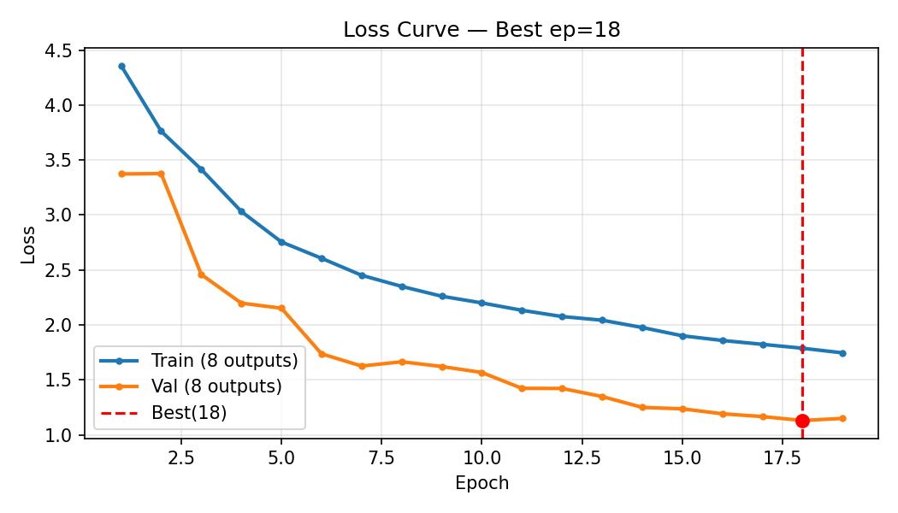

Biểu đồ tổng hợp loss và learning rate:

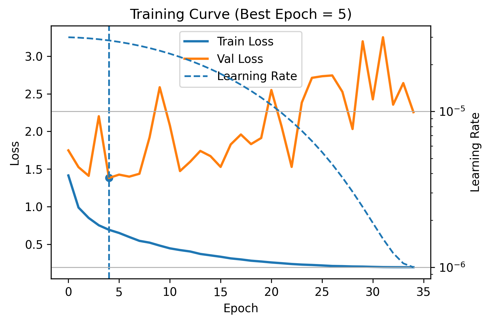

Lịch learning rate warmup + cosine:

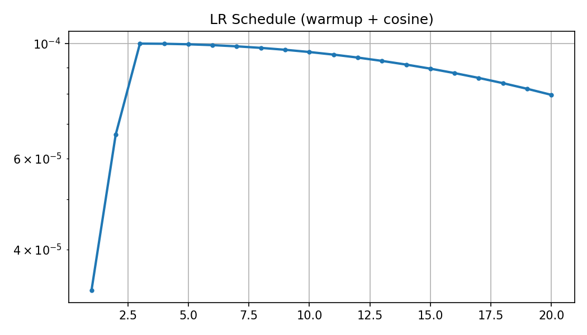

Các metric validation tăng dần theo epoch, trong khi MAE giảm mạnh. Dựa trên biểu đồ, MAE validation giảm từ khoảng `0.19-0.21` xuống khoảng `0.048` ở cuối quá trình train.

| Metric validation | Giá trị xấp xỉ cuối quá trình train |
| --- | ---: |
| `wFm` | 0.89-0.90 |
| `bFm` | 0.78 |
| `S-measure` | 0.89-0.90 |
| `E-measure` | 0.92 |
| `MAE` | 0.048 |

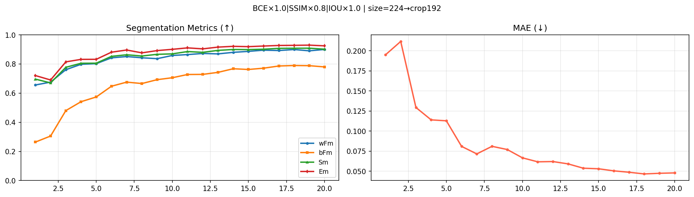

## 13. Kết quả đánh giá DUTS-TE

`basnet_evaluate.py` đánh giá mô hình `basnet_best_mae.pth` trên subset DUTS-TE gồm 1000 ảnh với seed 42. Kết quả được đọc từ các hình đánh giá đã sinh trong `figures/`.

| Metric | Kết quả |
| --- | ---: |
| Weighted F-measure `wFm` | 0.6672 |
| Boundary F-measure `bFm` | 0.6231 |
| S-measure `Sα` | 0.7525 |
| E-measure `Em` | 0.8119 |
| MAE | 0.0823 |

Biểu đồ per-sample cho `wFm`, `bFm`, `S-measure`, `E-measure`:

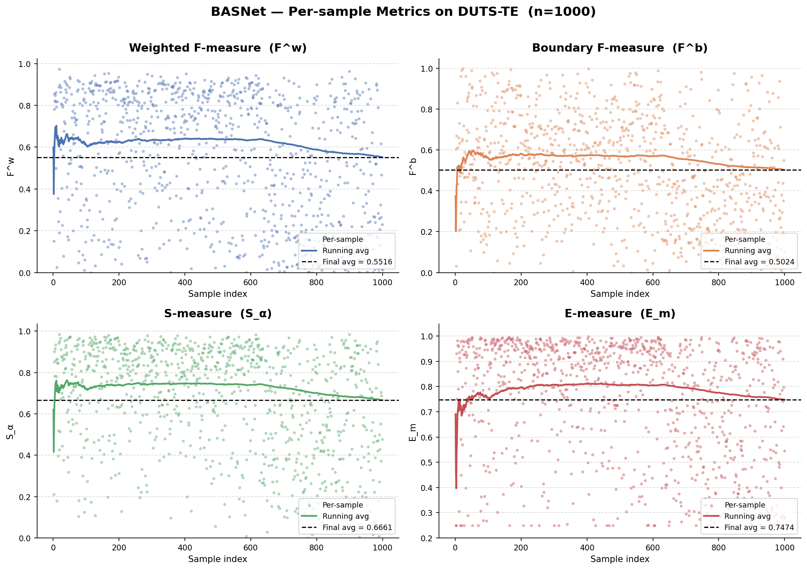

Biểu đồ per-sample MAE:

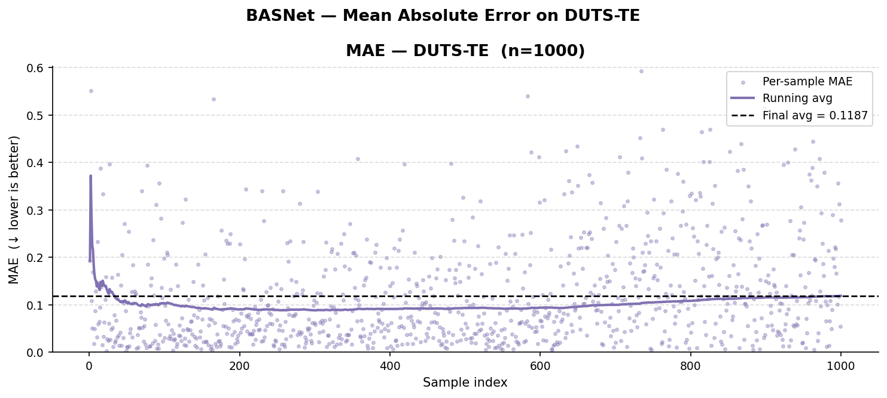

## 14. Kết quả định tính

Hình dưới so sánh mask dự đoán từ các checkpoint được chọn theo các tiêu chí khác nhau: `MAE`, `SM`, `ValLoss`, `WFM`. Kết quả cho thấy các checkpoint đều tách được đối tượng chính khỏi nền; khác biệt chủ yếu nằm ở độ đầy của vùng mask và độ sắc/ổn định ở biên.

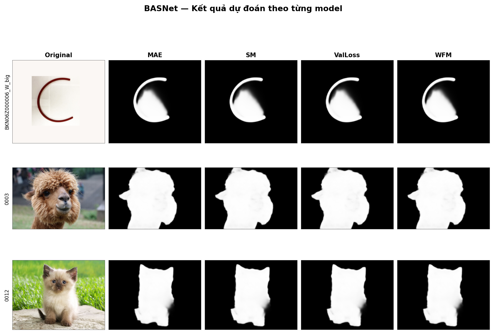

## 15. Lỗi thường gặp

### Thiếu checkpoint `.pth`

Triệu chứng:

```text
FileNotFoundError hoặc [ERROR] Model not found
```

Cách xử lý:

- Tải checkpoint từ Google Drive.
- Đặt file `.pth` vào `saved_models/basnet_bsi/`.
- Kiểm tra `model_path` trong `basnet_evaluate.py` hoặc `MODELS` trong `basnet_test.py`.

### Thiếu dataset

Triệu chứng:

```text
train images: 0
validation images: 0
```

Cách xử lý:

- Kiểm tra lại cấu trúc `train_data/DUTS/DUTS-TR/`.
- Kiểm tra lại cấu trúc `validation_data/DUTS-TE/`.
- Đảm bảo tên thư mục ảnh/mask đúng như code khai báo.

### Sai đường dẫn ảnh/mask

Nếu dataset đã tồn tại nhưng code vẫn không đọc được, kiểm tra các biến:

```python
data_dir
tra_image_dir
tra_label_dir
test_data_dir
test_image_dir
test_label_dir
```

## 16. Nhận xét thực nghiệm

Các kết quả thu được cho thấy pipeline PBL4 đã huấn luyện được mô hình có khả năng phân đoạn đối tượng nổi bật, loss giảm đều, metric validation tăng và MAE giảm rõ rệt. Việc thêm validation, checkpoint theo nhiều metric và biểu đồ per-sample giúp quá trình đánh giá minh bạch hơn so với script gốc chỉ train/inference cơ bản.

Tuy nhiên, kết quả này không phải benchmark trực tiếp với bài báo BASNet gốc. Paper gốc huấn luyện với cấu hình lớn hơn, ảnh 320x320, crop 288x288, batch size 8 và khoảng 400k iterations trên GPU RTX Titan 24GB. Dự án PBL4 dùng cấu hình nhỏ hơn để phù hợp GPU ít VRAM, vì vậy mục tiêu chính là fine-tuning và xây dựng pipeline thực nghiệm hoàn chỉnh.

Hạn chế hiện tại:

- DUTS-TE mới được đánh giá trên subset 1000 ảnh, chưa phải toàn bộ tập.
- Một số giá trị validation trong README được đọc xấp xỉ từ biểu đồ, không phải log số gốc.
- Chất lượng biên còn phụ thuộc mạnh vào kích thước input/crop và checkpoint được chọn.

## 17. Kết luận

Dự án đã hoàn thiện một phiên bản BASNet fine-tuning có khả năng:

- huấn luyện trên DUTS-TR với augmentation,
- validation định kỳ bằng nhiều metric,
- lưu checkpoint theo các tiêu chí khác nhau,
- đánh giá trên DUTS-TE,
- sinh biểu đồ loss/metric/lr,
- trực quan hóa kết quả dự đoán định tính.

Những cải tiến này giúp dự án phù hợp hơn cho mục tiêu học thuật PBL4: không chỉ chạy lại BASNet gốc mà còn xây dựng được quy trình thực nghiệm, đánh giá và phân tích kết quả rõ ràng.

## 18. Tài liệu tham khảo

```bibtex
@article{DBLP:journals/corr/abs-2101-04704,
  author = {Xuebin Qin and Deng-Ping Fan and Chenyang Huang and Cyril Diagne and Zichen Zhang and Adri{\`{a}} Cabeza Sant'Anna and Albert Su{\`{a}}rez and Martin Jagersand and Ling Shao},
  title = {Boundary-Aware Segmentation Network for Mobile and Web Applications},
  journal = {CoRR},
  volume = {abs/2101.04704},
  year = {2021},
  url = {https://arxiv.org/abs/2101.04704}
}
```

```bibtex
@InProceedings{Qin_2019_CVPR,
  author = {Qin, Xuebin and Zhang, Zichen and Huang, Chenyang and Gao, Chao and Dehghan, Masood and Jagersand, Martin},
  title = {BASNet: Boundary-Aware Salient Object Detection},
  booktitle = {The IEEE Conference on Computer Vision and Pattern Recognition (CVPR)},
  month = {June},
  year = {2019}
}
```
